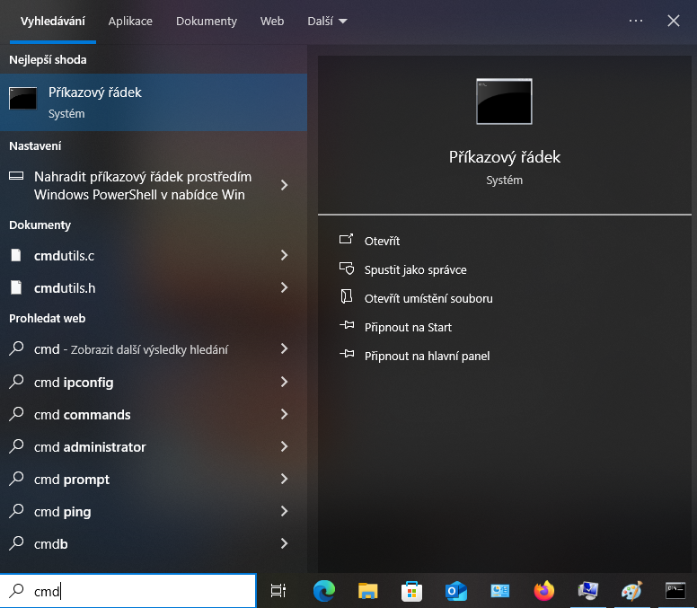

## Mám již pip? (nainstalován v systému)

Nejprve zkontroluj, zda již máš nainstalovaný pip:

- Otevřete příkazový řádek zadáním `cmd` do vyhledávacího pole v nabídce Start a poté kliknutím na **Příkazový řádek**:

    

    Pokud **nepoužíváš** svůj vlastní počítač doma (například pokud používáš počítač ve školní síti), možná se v nabídce nezobrazí **Příkazový řádek**. Může se stát, že ti možná nebude povoleno jej otevřít, protože nemáš oprávnění správce. V takovém případě si prosím promluv s učitelem, nebo správcem sítě o tom, zda vaše síť umožňuje použití příkazového řádku k instalaci Python softwaru. Pokud nemáš oprávnění používat příkazový řádek, předej tuto příručku svému učiteli/správci sítě, aby za tebe mohl nainstalovat moduly Pythonu.

- Do příkazového řádku zadej následující příkaz a stiskni <kbd>Enter</kbd>, abys zjistil, zda je pip již nainstalován:

    ```bash
    pip --version
    ```

- Pokud je pip nainstalován a funguje, uvidíš číslo verze, jako je toto:

    

- Pokud ano, jsi připraven použít pip k instalaci jakéhokoli Pythonového modulu, který se ti líbí. Zadáním následujícího příkazu do příkazového řádku (nahraď `název_modulu` názvem požadovaného modulu) modul nainstaluješ:

    ```bash
    pip install název_modulu
    ```

- Pokud nevidíte číslo verze a místo toho se vám zobrazí chybová zpráva, pokračujte v práci s tímto průvodcem. (pip není na počítači nainstalován)
