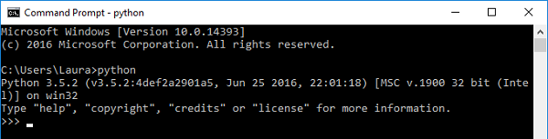
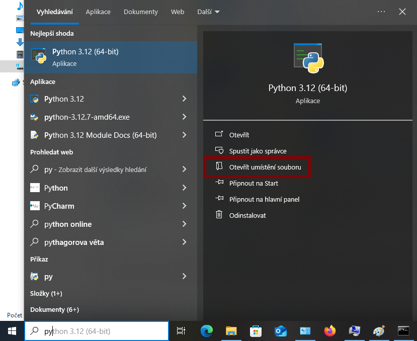
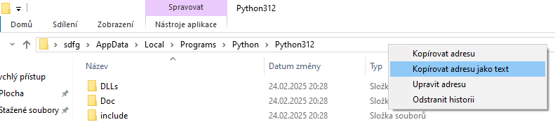
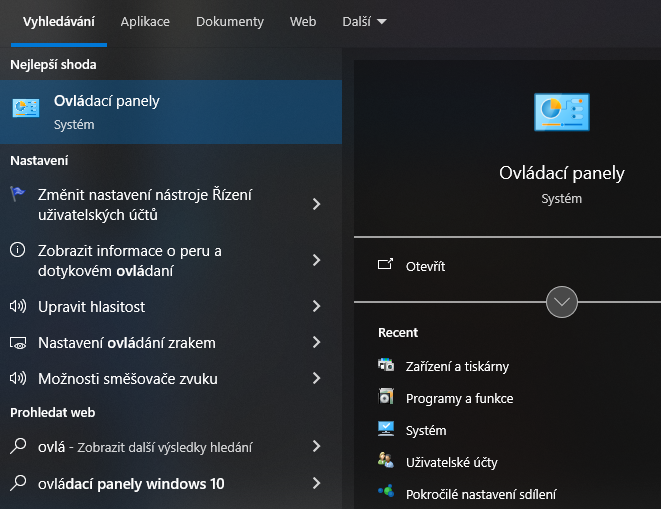
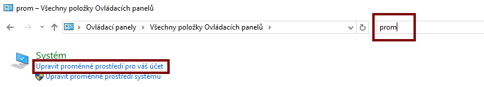
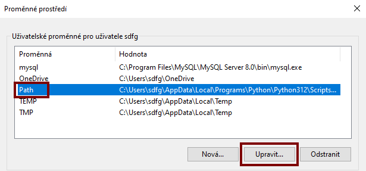
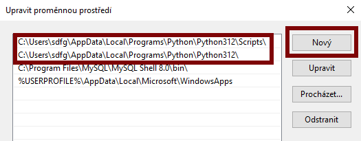
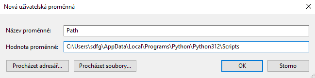

## Je Python v tvé PATH? (proměnná operačního systému)

Pokud jsi šel venku a našel krajtu na své cestě, bylo by to opravdu špatné! Hovoříme však o tom, zda je umístění Pythonu ve Windows `PATH`, což je seznam míst, kde Windows automaticky hledají software.

- Do příkazového řádku zadejte `python` a stiskněte <kbd>Enter</kbd>. Pokud je Python ve vaší `PATH`, měli byste vidět, že se spouští:

    

    Pokud jsi viděl spuštění Pythonu, přeskoč na další sekci. Pokud se ti místo toho zobrazila chybová zpráva, postupuj podle níže uvedených kroků a přidej Python do své `PATH`.

- Do vyhledávacího pole Windows zadejte `python.exe`, ale **** na něj v nabídce neklikejte. Místo toho na něj **klikni pravým tlačítkem**a vyber **Otevřít umístění souboru**

    

- Otevře se okno s některými soubory a složkami: zde by měl být nainstalován Python. Klikni pravým tlačítkem na adresní řádek nahoře a vyber **Otevřít umístění souboru**.

    

    Poznámka: Pokud adresní řádek obsahuje slova **Nabídka Start**, pak se pravděpodobně díváš na zástupce Pythonu. Klikni pravým tlačítkem myši na soubor s názvem `Python 3.x` (kde `3.` je číslo verze instalace v Pythonu) a vyber **Otevři umístění souboru**, dokud neuvidíš složku obsahující soubor s názvem `python.exe`.

- Z hlavní nabídky Windows otevři Ovládací panely:

    

- Do vyhledávacího pole vpravo nahoře zadej `prostředí`a ve výsledcích vyhledávání klikni na **Upravit proměnné prostředí**:

    

- Pokud již existuje proměnná nazvaná **Path**, kliknutím na ni ji vyber a poté klikni na **Upravit...**. Pokud neexistuje, klikni místo toho na **Nová...**.

    

- Pokud tvé vyskakovací okno vypadá jako na obrázku níže, klikni na **Nová** a vlož adresu, kterou jsi právě zkopíroval. Poté znovu klikni na **Nová**, vlož adresu znovu a na konec přidej `Scripts\`. Klikni dvakrát na **OK** pro dokončení úprav proměnných prostředí.

    

- Pokud má tvé vyskakovací okno pouze jeden řádek pro proměnnou hodnotu, vlož adresu, zadej středník (`;`), poté znovu vlož adresu a přidej `Scripts\` na konec. Klepnutím na **OK** dokončíš úpravy proměnných prostředí.

    

- Pokud je okno příkazového řádku stále otevřené, zavři jej a znovu otevři. Tím se ujistíš, že se změny projevily v příkazovém řádku, který používáš.

- Ještě jednou zadej `python` v příkazovém řádku a stiskni klávesu <kbd>Enter</kbd>. Nyní bys měl vidět úspěšné spuštění Pythonu. Stisknutím <kbd>Ctrl</kbd> + <kbd>c</kbd> ukončíš prostředí Pythonu.

