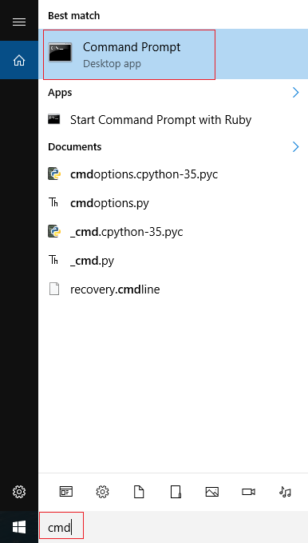

## Do I already have pip?

First, let's check whether you already have pip installed:

- Open a command prompt by typing `cmd` into the search bar and then clicking on **Command Prompt** in the menu:

    

    If you are not using your own computer at home (for example, if you are using a computer on a school network), you may not see **Command Prompt** appear in the menu, or you may not be allowed to open it because you don't have administrator privileges. Please speak to your network manager about whether your network allows the use of the command prompt to install Python software, as it is common for access to be blocked. If you are not permitted to use the command prompt, pass this guide to your network manager so they can install Python modules on your behalf.

- Type the following command into the command prompt and press Enter to see if pip is already installed:

    ```bash
    pip --version
    ```

- If pip is installed and working you will see a version number like this.

    

    If so, you already have pip and can install any Python module you like by typing the following into a command prompt:

    ```bash
    pip install name-of-module
    ```

    If you don't see a version number and instead get an error message, continue working through this guide.

