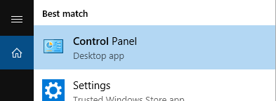
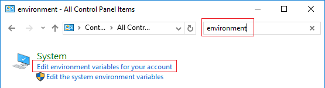
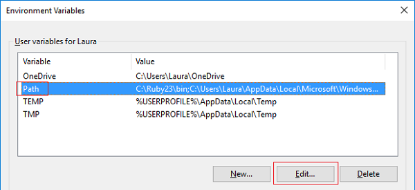
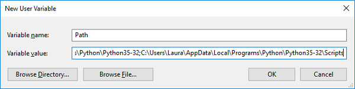

## Is Python in your `PATH`?

If you walked outside and found a python on your path, that would be really bad! However, we're talking about whether the location of Python is in the Windows `PATH`, which is the list of places where Windows automatically looks for software.

- In the command prompt, type `python` and press <kbd>Enter</kbd>. If Python is in your `PATH`, you should see it start up:

    

    If you saw Python start up, skip to the next section. If you saw an error message instead, follow the steps below to add Python to your `PATH`.

- In the Windows search bar, type in `python.exe`, but **don't** click on it in the menu. Instead, **right-click** on it, and select **Open file location**

    

- A window will open up with some files and folders: this should be where Python is installed. Right-click on the address bar at the top and select **Copy address as text**.

    

    Note: if the address bar contains the words **Start menu**, then you are probably looking at a shortcut to Python. Right-click on the file called `Python 3.x` (where `3.x` is the version number of your Python installation) and select **Open file location** until you see a folder containing a file called `python.exe`.

- From the main Windows menu, open the Control Panel:

    

- In the search box on the top right, type in `environment`, and in the search results, click on **Edit environment variables for your account**:

    

- If there is already a variable listed called **Path**, click on it to select it, then click **Edit...**. If it does not exist, instead click **New...**.

        

- If your pop-up box looks like the image below, click **New** and then paste in the address you just copied. Then click **New** again, paste in the address again, and add `Scripts\` at the end. Click **OK** twice to finish editing your environment variables.

      

- If your pop-up box has only a single line for the variable value, paste in the address, type a semicolon (`;`), then paste in the address again and add `Scripts\` at the end. Click **OK** to finish editing environment variables.

      

- If the the command prompt window is still open, close it and re-open it. This will make sure the changes have taken effect in the command prompt you are using.

- Once again, type in `python` at the command prompt and press the <kbd>Enter</kbd> key. You should now see Python start successfully. Press <kbd>Ctrl</kbd> + <kbd>c</kbd> to exit the Python shell.

