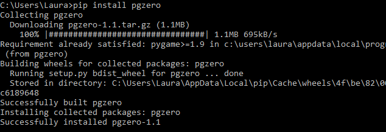

## Installing pip

Now that you can use Python from the command line, you can use pip! These instructions should work for Python version 3.4 or above. If you are using an earlier version of Python, you can upgrade to a newer version from the [Python website](https://www.python.org/downloads/).

- At the command prompt, type the following command to upgrade pip:

    ```python
    python -m pip install -U pip
    ```

- Now you can use pip! You can install modules using the `pip install` command. For example, if you wanted to download the `guizero` library you would type this:

    ```bash
    pip install guizero
    ```

- If you use online guides, you may often see instructions for installing Python packages with pip on **Linux**, for example you might see this command given to install the Pygame Zero library:

    ```bash
    sudo pip3 install pgzero
    ```

    This command won't work on Windows. To convert it into a command you can use, take the name of the library and type `pip install` in front of it:

    ```bash
    pip install pgzero
    ```

      

