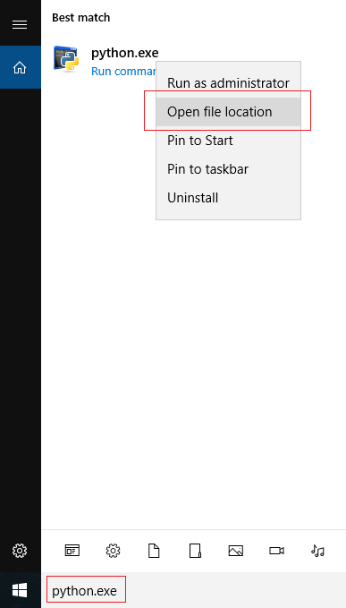

## क्या Python आपके `PATH` में है?

यदि आप बाहर चले गए और अपने रास्ते पर एक Python पाया, तो यह वास्तव में बुरा होगा! हालाँकि, हम इस बारे में बात कर रहे हैं कि क्या Python का location विंडोज `PATH` में है, जो उन स्थानों की सूची है जहां विंडोज स्वचालित रूप से सॉफ्टवेयर ढुंढ़ता है।

- कमांड प्रॉम्प्ट में, `Python` टाइप करें और <kbd>Enter</kbd> दबाएं । यदि Python आपके `PATH` में है, तो यह आपको शुरू होते दिखेगा:

    

    यदि आपने Python शुरू होते देखा है, तो अगले भाग पर जाएं। अगर आपको इसके बजाय एक त्रुटि संदेश दिखाई दिया, तो अपने `PATH` में Python को जोड़ने के लिए नीचे दिए गए स्टेप्स का पालन करें ।

- विंडोज सर्च बार में, `python.exe` टाइप करें, लेकिन मेनू में इस पर क्लिक **न** करें। इसके बजाय, उस पर **राइट-क्लिक** करें, और **Open फ़ाइल location** का चयन करें

    

- कुछ फ़ाइलों और फ़ोल्डरों के साथ एक विंडो खुल जाएगी: यह वह जगह होगी जहां Python इन्स्टाॅल्ड है। सबसे ऊपर एड्रेस बार पर राइट-क्लिक करें और **Copy address as text** का चयन करें ।

    

    नोट: यदि एड्रेस बार में **Start menu**शब्द है, तो आप शायद Python के लिए एक शॉर्टकट देख रहे हैं। `Python 3.x`नामक फ़ाइल पर राइट-क्लिक करें (जहाँ `3.x` आपके Python इंस्टॉलेशन का वर्ज़न नम्बर है) और **Open फ़ाइल location**का चयन करें जब तक आपको एक फ़ोल्डर दिखाई न दे, जिसमें `python.exe` नामक फ़ाइल हो।

- मुख्य(main) विंडोज मेन्यू से, Control Panel खोलें:

    

- शीर्ष दाईं ओर खोज बॉक्स में, `environment` टाइप करें, और खोज परिणामों में, **अपने खाते के लिए संपादन करना environment वेरिएबल** पर क्लिक करें:

    

- यदि पहले से ही एक वेरियबल सूचीबद्ध है जिसे **Path** कहा जाता है, इसे चुनने के लिए उस पर क्लिक करें, फिर **संपादन करना...**... पर क्लिक करें । यदि यह मौजूद नहीं है, तो इसके बजाय **New...** क्लिक करें ।

    

- यदि आपका पॉप-अप बॉक्स नीचे की छवि जैसा दिखता है, तो **New**को क्लिक करें और फिर उस address को पेस्ट करें जिसे आपने अभी कॉपी किया है। फिर से **New** को क्लिक करें फिर address को फिर से पेस्ट करें, और अंत में `Scripts\` जोड़ें। Environment variables की ईडिटिन्ग को पुरा करने के लिये **OK**पर दो बार क्लिक करें

    

- यदि आपके पॉप-अप बॉक्स में वेरियबल वैल्यु के लिए केवल एक ही लाइन है, तो address में पेस्ट करें, एक अर्धविराम (semicolon) (`;`) टाइप करें, फिर address में पेस्ट करें और अंत में `Scripts\` जोड़ें। Environment variables की ईडिटिन्ग को पुरा करने के लिये **OK**पर क्लिक करें

    

- यदि कमांड प्रॉम्प्ट विंडो अभी भी खुली है, तो इसे बंद करें और इसे फिर से खोलें। यह सुनिश्चित करेगा कि आपके द्वारा उपयोग किए जा रहे कमांड प्रॉम्प्ट में परिवर्तन प्रभावी तौर पर हुए हैं।

- एक बार फिर, कमांड प्रॉम्प्ट में `Python` टाइप करें और <kbd>Enter</kbd> कुंजी दबाएं। अब आपको देखना चाहिए कि Python सफलतापूर्वक शुरू हुआ। Python शैल से बाहर निकलने के लिए।<kbd>Ctrl</kbd> + <kbd>C</kbd>दबाएं

