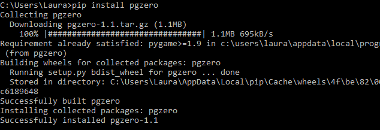

## Pip का उपयोग

अब जब आप कमांड लाइन से Python का उपयोग कर सकते हैं, तो आप pip का उपयोग कर सकते हैं! निम्नलिखित निर्देशों को Python वर्ज़न 3.4 और इसके बाद के वर्ज़न के लिए काम करेगा। यदि आप Python के पुराने वर्ज़न का उपयोग कर रहे हैं, तो आप Python को [ Python वेबसाइट ](https://www.python.org/downloads/)के माध्यम से अपग्रेड कर सकते हैं ।

- कमांड प्रॉम्प्ट विंडो में, pip को अपग्रेड करने के लिए निम्न कमांड टाइप करें:

    ```python
    python -m pip install -U pip
    ```

- अब आप ` pip install `कमांड का उपयोग करके मॉड्यूल इन्स्टाॅल कर सकते हैं । उदाहरण के लिए, यदि आप ` guizero` मॉड्यूल को डाउनलोड और इंस्टॉल करना चाहते हो, तो आप टाइप करेंगे:

    ```bash
    pip install guizero
    ```

- यदि आप ऑनलाइन गाइड का उपयोग करते हैं, तो आप अक्सर ** Linux ** पर pip के साथ Python पैकेज इन्स्टाॅल करने के निर्देश देख सकते हैं। उदाहरण के लिए, आप Pygame Zero मॉड्यूल को इन्स्टाॅल करने के लिए यह कमांड देख सकते हैं:

    ```bash
    sudo pip3 install pgzero
    ```

    यह कमांड विंडोज पर काम नहीं करेगी। इसको एक कमांड में बदलने के लिए जिसे आप उपयोग कर सकते हैं, मॉड्यूल का नाम लें और, उसके सामने ` pip install ` लिखें:

    ```bash
    pip install pgzero
    ```

    


### अन्य pip कमांड

[ pip.pypa.io ](https://pip.pypa.io)पर pip के लिए व्यापक प्रलेखन है - यह रहे कुछ उपयोगी कमांड:

+ पहले से इन्स्टाॅल्ड मॉड्यूल को अपग्रेड करें:

```bash
pip install --upgrade name_of_module 
```

+ मॉड्यूल अनइन्सटाॅल करें

```bash
pip uninstall name_of_module
```

+ इन्स्टाॅल्ड मॉड्यूल को सुचीबद्ध करें

```bash
pip list
```
