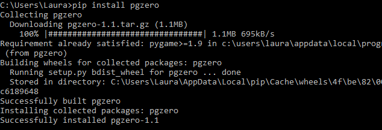

## Using pip

Now that you can use Python from the command line, you can use pip! The following instructions should work for Python version 3.4 and above. If you are using an older version of Python, you can upgrade Python via [the Python website](https://www.python.org/downloads/).

- In the command prompt window, type the following command to upgrade pip:

    ```python
    python -m pip install -U pip
    ```

- Now you can install modules using the `pip install` command. For example, if you wanted to download and install the `guizero` module, you would type this:

    ```bash
    pip install guizero
    ```

- If you use online guides, you might often see instructions for installing Python packages with pip on **Linux**. For example, you might see this command to install the Pygame Zero module:

    ```bash
    sudo pip3 install pgzero
    ```

    This command won't work on Windows. To convert it into a command you can use, take the name of the module and type `pip install` in front of it:

    ```bash
    pip install pgzero
    ```

    


### Other pip commands

There is comprehensive documentation for pip at [pip.pypa.io](https://pip.pypa.io) — here are a few useful commands:

+ Upgrade an already installed module:

```bash
pip install --upgrade name_of_module 
```

+ Uninstall a module:

```bash
pip uninstall name_of_module
```

+ List installed modules:

```bash
pip list
```
