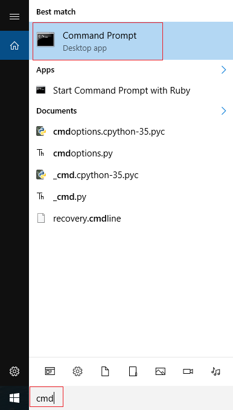
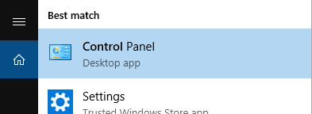
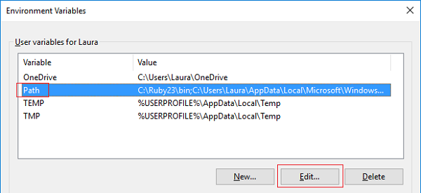

# Using pip on Windows

In this resource you will learn how to use pip on Windows so that you can easily install useful Python software

## What is pip?

If you have used Python before, you may have used code similar to these examples:

```python
from time import sleep
```

or perhaps

```python
import random
```

In the examples above, you are using code from a **library** written by somebody else. The libraries in the examples above are called `time` and `random` and are included by default when you install Python.

However, lots of other code libraries which do useful things exist, and you might want to use some of the functions in your Python programs. For example if you want to manipulate images you might want to use `PIL`, you could make games with `pygame` or craft GUIs with `guizero`. However, if you try to use these libraries without installing them, they won't work:


This is where you need **pip**. You can use pip to install Python libraries on your computer so that you can use them in your programs. You have probably seen instructions for installing Python libraries in guides on the Raspberry Pi website and on other websites. **pip** is already installed on the Raspberry Pi with the standard Raspbian distribution. Howver, if you are using a Windows computer at home or at school, you may not have pip available as standard.

This resource will show you how to get pip working on a Windows computer.

## Do I already have pip?

First, let's check whether you already have pip installed:

1. Open a command prompt by typing `cmd` into the search bar and then clicking on `Command Prompt` in the menu:

    

    If you are not using a home computer (e.g. you are using a computer on a school network), you may not see `Command Prompt` appear in the menu, or you may not be allowed to open it as you lack administrator privileges. Please speak to your network manager about whether you are permitted to use the command prompt to install Python software as it is common for command prompt access to be disabled. If you are not permitted to use the command prompt, pass this guide to your network manager so that they can install Python libraries on your behalf.

1. Type in the following command to see if pip is already installed:

    ```bash
    pip --version
    ```

1. If pip is installed and working you will see a version number like this.

    

    If so, you already have pip and can install any Python module you like by typing the following into a command prompt:

    ```bash
    pip install name-of-module
    ```

    If you don't see a version number and instead get an error message, continue working through this guide.

## Is Python on your PATH?

If you walked outside and found a Python on your path it would be really bad! However, we're talking about whether the location of Python is on the Windows `PATH` which is a list of places Windows automatically looks for software.

1. In the command prompt, type `python` and press the enter key. If Python is on your PATH, you should see it start up:

    

    If you get an error message instead, follow the steps below to add Python to your PATH.

1. In the Windows search bar, type in `python.exe` but DON’T click on it in the menu. Instead, __right click__ on it and select **Open file location**

    

1. A window should open up with some files and folders - this is where Python is installed. Right click on the address bar at the top and select `Copy address as text`

    

1. From the main Windows menu, open the Control Panel

    

1. In the search box on the top right, type in `environment`, then in the search results click on `Edit environment variables for your account`

    

1. If there is already a variable listed called `Path`, click on it to select it then click `Edit...`. If it does not exist, instead click `New...`

        

1. In this menu, click `New` and then paste in the address you copied earlier. Then click `New` again, paste in the address again and add `Scripts\` at the end. Press `OK` twice to exit this dialogue box.

      

1. Close the command prompt window if it is still open, then re-open it. This will make sure the changes have taken effect in the command prompt you are using. Once again, type in `python` at the command prompt and press the enter key. You should now see Python start successfully. Press `Ctrl` + `c` to exit the Python shell.


## Installing pip

Now that you can use Python from the command line, you can use pip! These instructions should work for Python version 3.4 or above. If you are using an earlier version of Python, you can upgrade to a newer version from the [Python website](https://www.python.org/downloads/)

1. At the command prompt type the following command:

    ```python
    python -m pip install -U pip
    ```

1. Now you can use pip! You can install libraries using the `pip install` command, for example if you wanted to download the guizero library you would type this:

    ```bash
    pip install guizero
    ```

1. If you use online guides, you may often see instructions for installing Python packages with pip on **Linux**, for example you might see this command given to install the Pygame library:

    ```bash
    sudo pip3 install pygame
    ```

    To convert this into a command you can use on Windows, just take the name of the library and type `pip install` in front of it:

    ```bash
    pip install pygame
    ```

## What's next

Have fun using pip to install lots of new packages! Why not try these resources which require Python libraries to be installed:
- [Getting started with GUIs](http://www.raspberrypi.org/learning/getting-started-with-guis)
- [Shakespearean insult generator](https://www.raspberrypi.org/learning/shakespearean-insult-generator/)
